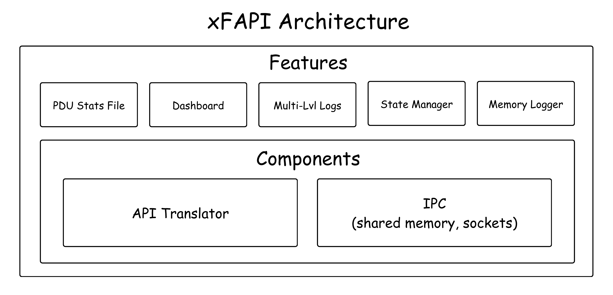
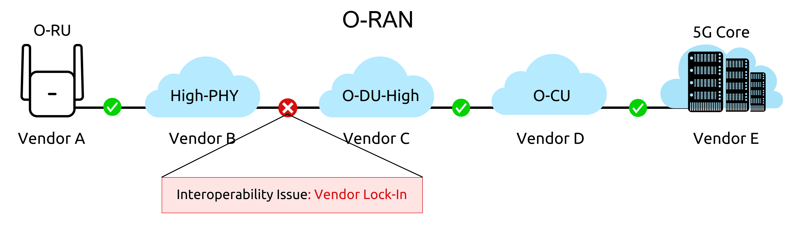
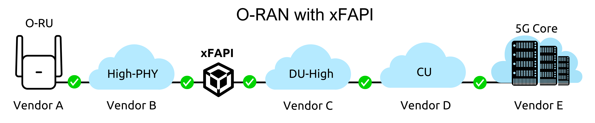
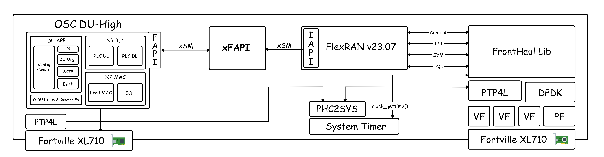
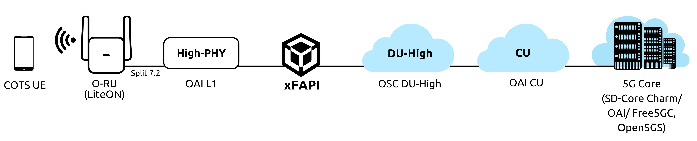

<table style="border-collapse: collapse; border: none;">
  <tr style="border-collapse: collapse; border: none;">
    <td style="border-collapse: collapse; border: none;">
      <a href="http://www.coranlabs.com/">
         
         </img>
      </a>
    </td>
    <td style="border-collapse: collapse; border: none; vertical-align: center;">
      <b><h1>xFAPI: Facilitating Interoperability at L1-L2 Interface in O-RAN </h1></b>
    </td>
  </tr>
</table>

## Table of Contents

- [Introduction](#introduction)
- [Purpose of xFAPI](#purpose-of-xfapi)
- [Current Landscape](#current-landscape)
  - [L1-L2 Support](#l1-l2-support)
    - [FlexRAN OSC DU-High Topology](#flexran-osc-du-high-topology)
    - [OAI L1 OSC DU-High Topology](#oai-l1-osc-du-high-topology)
  - [IPC Mechanism Support](#ipc-mechanism-support)
- [Reference Architecture](#reference-architecture)
- [References](#references)

## Introduction

xFAPI is an intermediate component that establishes connections between any L1 and L2 layer of O-RAN, operating as a translator for both FAPI and nFAPI interfaces.

xFAPI acts as a translator, providing interoperability between different IPC mechanisms, including shared memory (xSM) and sockets (nFAPI). Additionally, xFAPI includes an integrated capability that can be activated at runtime based on compilation flag that will check if L1-L2 are interoperable and provide the option to use xFAPI if desired (for additional functionalities such as detailed PDU stat generation at both interfaces, debugging tools like memory logger, state manager, multi-level logging, and monitoring and analysis on the dashboard)

> [!NOTE]  
> xSM is a comprehensive shared memory library supporting various shared memory mechanisms, enabling L1 and L2 vendors to exchange messages on a common platform.



## Purpose of xFAPI

- Closed MAC-PHY Interface: Despite O-RAN's emphasis on modularity and open interfaces, the MAC-PHY interface, i.e. FAPI, is not open yet.



- Vendor-Specific Implementations: L1 vendors design their software such that L2-L3 vendors, who adhere to 3GPP standards, must either modify their code to align with L1 specifications or use an additional component to facilitate the connection, risking 3GPP compliance.

- Intermediary Components: To maintain compliance and ensure end-to-end connection, most L2-L3 vendors opt to use intermediary components. Each L1 vendor proposes a unique intermediary component and shared memory library implementation, which leads to vendor lock-in.

- Complex Integration: L2-L3 vendors aiming to demonstrate interoperability with different L1s face the challenge of managing multiple intermediary components and shared memory libraries, one for each L1 vendor.



By addressing these issues, xFAPI aims to provide a unified and standardized interface that promotes interoperability and reduces vendor lock-in.

## Current Landscape

### L1-L2 Support

| L1      | L2  | Status      |
| ------- | --- | ----------- |
| FlexRAN | OSC | ✅ Done     |
| OAI     | OAI | 🟡 Ongoing  |
| OAI     | OSC | 🟡 Ongoing  |
| FlexRAN | OAI | 📅 Planning |
| Aerial  | OSC | 📅 Planning |
| Aerial  | OAI | 📅 Planning |

#### FlexRAN OSC DU-High Topology

- xFAPI has successfully achieved end-to-end (E2E) connection between OSC DU-High and FlexRAN versions `v22.11` and `v23.07`.

  - **Topology:** 3GPP-Compliant 5G Core + modified OAI CU + modified OSC DU-High + xFAPI + FlexRAN v22.11/v23.07 + LiteON



#### OAI L1 OSC DU-High Topology

- xFAPI is currently being modified to support the nFAPI interface at the L1 side, which will enable a successful connection between OSC DU-High and OAI L1.

  - **Topology:** 3GPP-Compliant 5G Core + modified OAI CU + modified OSC DU-High + xFAPI + OAI L1 + LiteON + COTS UE



### IPC Mechanism Support

| IPC Mechanism         | L1-Side Interface      | L2-Side Interface |
| --------------------- | ---------------------- | ----------------- |
| Shared Memory (WLS)   | ✅ Supported           | ✅ Supported      |
| Sockets (nFAPI)       | 🟡 Partially supported | 📅 Planning       |
| Shared Memory (nvIPC) | 📅 Planning            | 📅 Planning       |

## Reference Architecture


```r
+---------------+-----------------------------------------------------------+--------------------------------+
| Communities   |                    Current Landscape                      |          Future Plans          |
|               +-----------------------------------------------------------+--------------------------------+
|               |                   Supported Topologies                    |       Topologies Support       |
|               +------+------------+-----------+---------------------------+------+------------+------------+
|               | No.  | L1         | L2        | Dis-aggregation Support   | No.  | L1         | L2         |
+---------------+------+------------+-----------+---------------------------+------+------------+------------+
| OSC           | 1    | FlexRAN    | OSC       | N/A                       | 2    | FlexRAN    | OSC        |
|               |      |            |           |                           |      +------------+------------+
|               |      |            |           |                           |      | OAI        | OSC        |
+---------------+------+------------+-----------+---------------------------+------+------------+------------+
| OAI           | 2    | OAI        | OAI       | Yes                       | 3    | OAI        | OAI        |
|               |      +------------+-----------+---------------------------+      +------------+------------+
|               |      | Nvidia     | OAI       | N/A                       |      | Aerial     | OAI        |
|               |      |            |           |                           |      +------------+------------+
|               |      |            |           |                           |      | OSC        | OAI        |
+---------------+------+------------+-----------+---------------------------+------+------------+------------+
| xFAPI         | 4    | FlexRAN    | OSC       | Yes                       | Any  | FlexRAN    | OSC        |
|               |      |            |           |                           |      +------------+------------+
|               |      |            |           |                           |      | FlexRAN    | OAI        |
|               |      +------------+-----------+---------------------------+      +------------+------------+
|               |      | FlexRAN    | OAI       | Yes                       |      | OAI        | OSC        |
|               |      |            |           |                           |      +------------+------------+
|               |      |            |           |                           |      | OAI        | OAI        |
|               |      +------------+-----------+---------------------------+      +------------+------------+
|               |      | OAI        | OAI       | Yes                       |      | Aerial     | OSC        |
|               |      |            |           |                           |      +------------+------------+
|               |      |            |           |                           |      | Aerial     | OAI        |
|               |      +------------+-----------+---------------------------+      +------------+------------+
|               |      | OAI        | OSC       | Yes                       |      | ---        | ---        |
|               |      |            |           |                           |      +------------+------------+
|               |      |            |           |                           |      | ---        | ---        |
+---------------+------+------------+-----------+---------------------------+------+------------+------------+

```

## References

| **Topic**             | **Type**     | **Links**                                                                                                                                                                                                                                                                                                                                                               |
| --------------------- | ------------ | ----------------------------------------------------------------------------------------------------------------------------------------------------------------------------------------------------------------------------------------------------------------------------------------------------------------------------------------------------------------------- |
| Introduction to xFAPI | Video        | [Watch](https://youtu.be/1oO_DIiZfug?si=m9HwykFD4aMxpYi7)                                                                                                                                                                                                                                                                                                               |
| xFAPI Proposal        | Presentation | [View](https://wiki.o-ran-sc.org/download/attachments/78217260/xFAPI%20Proposal.pdf?api=v2)                                                                                                                                                                                                                                                                             |
|                       | Recording    | [Watch](https://zoom.us/rec/play/G54aZjpA34mBBkagXaHKS2-czoy8oEQ8m7bPI7vaKgSvH1UGqwSx0bx3uF7Bb37RRgQpOp1f-4v4Wo0i.KJt64HspDhWl75ov?canPlayFromShare=true&from=share_recording_detail&continueMode=true&componentName=rec-play&originRequestUrl=https%3A%2F%2Fzoom.us%2Frec%2Fshare%2F-ZFH16_eVRto4atlwUE6l77dKtoJj53_bfZvZ3wgWWI9nDJc3dvZZiK-A5v-5Nrh.PyEgerJdoNW9qQbR) |
| xFAPI Blueprint       | Presentation | [View](https://wiki.o-ran-sc.org/download/attachments/78217260/xFAPI%20Blueprint.pdf?api=v2)                                                                                                                                                                                                                                                                            |
|                       | Recording    | [Watch](https://zoom.us/rec/play/deV06o9uQO1JlMRg93UIJHh6CYleU8OeYPl11zRVZkdiYKycdQWwnArWUvwIJdOmH1jVVh151063WRKW.UR4vegH8q1lK3187?canPlayFromShare=true&from=share_recording_detail&continueMode=true&componentName=rec-play&originRequestUrl=https%3A%2F%2Fzoom.us%2Frec%2Fshare%2FwmQNLvP9c1nOTzGHQsoaA7zP-lgwFO0XUW2OWIcTC2KtBNAIOIKlwib6pvvpENiD.Rkmvy2QyiMAk-bT1) |
