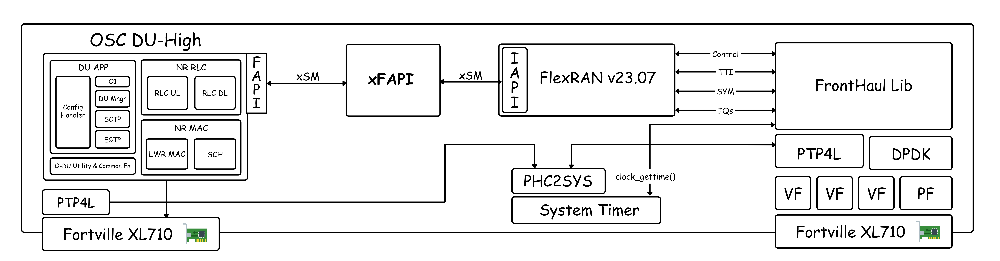

<table style="border-collapse: collapse; border: none;">
  <tr style="border-collapse: collapse; border: none;">
    <td style="border-collapse: collapse; border: none;">
      <a href="http://www.coranlabs.com/">
         
         </img>
      </a>
    </td>
    <td style="border-collapse: collapse; border: none; vertical-align: center;">
      <b>xFAPI: Facilitating Interoperability in Open RAN</b>
    </td>
  </tr>
</table>

## TABLE OF CONTENTS
1. [Introduction](#introduction)
2. [Need for xFAPI](#need-for-xfapi)
   - [Problem Statement](#problem-statement)
   - [Solution](#solution)
3. [Architecture](#architecture)
4. [Planning: Interoperable xFAPI](#planning-interoperable-xfapi)
5. [Current Scenario](#current-scenario)

## xFAPI

### Introduction

xFAPI is an intermediate component to establish the connections between any L1 and L2 Layers provided by any vendor in the industry, to make O-RAN, open at FAPI interface.
    
Currently, xFAPI can establish the connection between OSC DU-High and different versions of FlexRAN (v22.11 and onwards) and includes integrated support for Shared Memory (**xSM**) use across all three entities i.e. OSC DU-High, xFAPI and FlexRAN.

*__Note__*: **xSM** is an integrated library of xFAPI, used for shared memory access.

### Need for xFAPI?

#### Problem Statement:

- O-RAN is centered around the principles of modularity and open interfaces, yet the MAC-PHY interface, specifically FAPI, remains closed or not connected
- L1 vendors design their software in a way that makes L2-L3 vendors(who adhere to 3GPP standards) either modify their code to align with the L1 or use an additional component to facilitate the connection
- Altering the L2 code to match L1 specifications compromises its 3GPP compliance
- Consequently, most vendors opt to use an intermediary component to maintain an E2E connection while preserving their compliance status
- Each L1 vendor suggests a unique intermediary component & shared lib for interfacing with the L2-L3 layer which leads to vendor lock-in
- This variety made L2-L3 vendors, who aim to demonstrate interoperability with different L1s, manage multiple intermediary components and shared lib support, one for each L1

#### Solution:
- xFAPI bridges the gap between various L1 and L2 Layers
- It will be capable of establishing a networking layer that forms a packet-switched IP network to facilitate communication between VNF and PNF, performing the role of nFAPI
- It will adhere to SCF222 and SCF225 standards
- Currently, it is able to establish the connection b/w OSC DU-High and different versions
of FlexRAN
- xFAPI will be used to establish the connection between OSC DU-High and OAI L1
- Plans are underway to extend its capabilities to other L1 vendors, such as NVIDIA Aerial, to enable connectivity with OSC DU-High via xFAPI

## Architecture

## Planning: Interoperable xFAPI

- To address the challenge of maintaining multiple intermediate components, we developed a new component, xFAPI which will serve as a universal connector, bridging the gap between every L1 and L2, simplifying the integration process, and enhancing overall interoperability
- The purpose of xFAPI is to enhance the interoperability of OSC DU High, not just with FlexRAN, but also extend to include OAI and other vendors (e.g. NVIDIA Aerial)
- Rather than using different intermediate components for each L1, we will use a single common connector, xFAPI, for every connection between L2 and L1

## Current Scenario

- OAI adheres to the SCF222.10.02 standards, which are also utilized in the development of xFAPI
- All required 3GPP-based F1AP Procedures have been implemented between OSC DU-High and OAI CU
- OAI L1 is compatible with various 3rd party O-RUs including LiteON, which is being used in this project
- Successfully established E2E connections using OAI RAN Stack (CU-DU) with different 3rd Party O-RUs such as LiteON, Benetel, Accton
- Additionally, we have successfully tested the compatibility of the OAI RAN Stack with various open-source 5G Cores, including SD-Core, Open5GS, Free5GC, and OAI