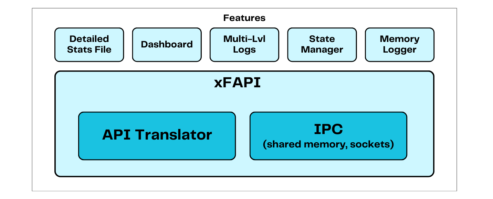
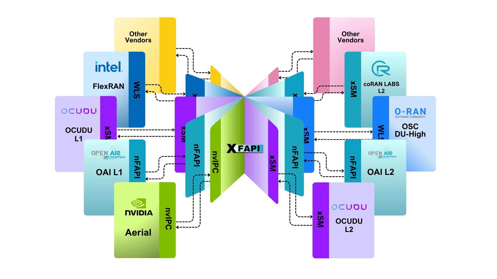
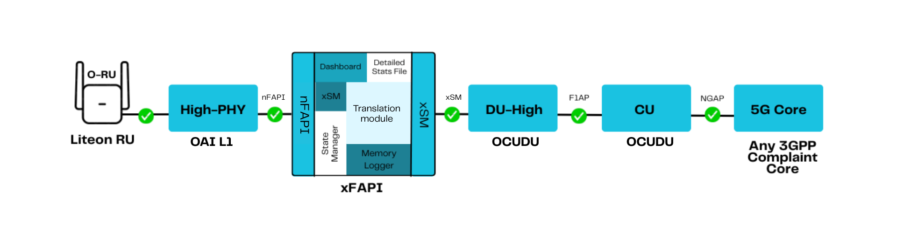
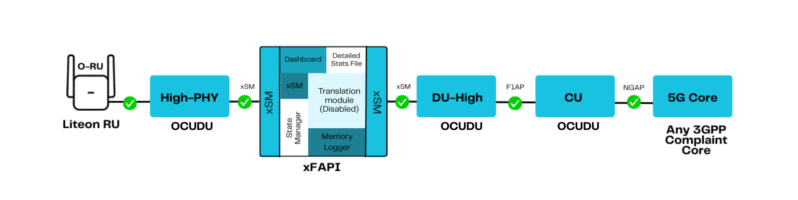
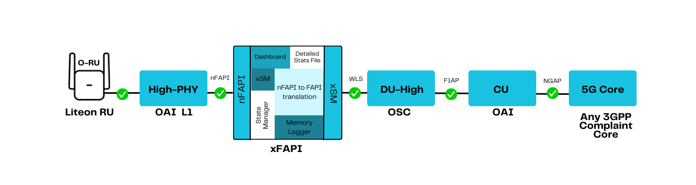
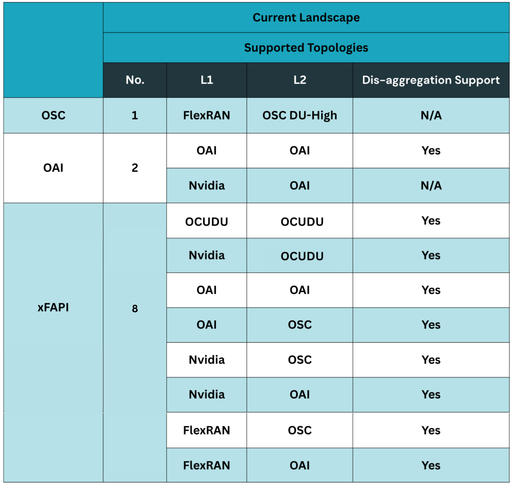

<table style="border-collapse: collapse; border: none; width: 100%;">
  <tr style="border-collapse: collapse; border: none;">
    <td style="border-collapse: collapse; border: none;">
      
    </td>
    <td style="border-collapse: collapse; border: none; width: 100%; text-align: center;">
      <b><h1>xFAPI: The Future of OpenRAN.</h1></b>
    </td>
  </tr>
</table>

<i>"Making the OpenRAN Truly Open."</i>

  
  

## Table of Contents
- [Introduction](#introduction)
- [Interoperability Issue in FAPI Interface](#interoperability-issue-in-fapi-interface)
  - [xFAPI Architecture](#xfapi-architecture)
- [Reference Architecture](#reference-architecture)
- [Need of xFAPI](#need-of-xfapi)
  - [OAI L1 - OCUDU L2 Topology](#oai-l1---ocudu-l2-topology)
  - [OCUDU L1 - OCUDU L2 Topology](#ocudu-l1---ocudu-l2-topology)
  - [FlexRAN OSC DU-High Topology](#flexran-osc-du-high-topology)
  - [OAI L1 OSC DU-High Topology](#oai-l1-osc-du-high-topology)
- [Additional Features](#additional-features)
- [References](#references)
- [Acknowledgements](#acknowledgements)
- [Build & Run](docs/BUILD_AND_RUN.md)

## Introduction

xFAPI is an intermediate component that facilitates interoperability between L1s and L2s from different vendors.
xFAPI acts as a translator, providing interoperability between different IPC mechanisms, including shared memory (xSM) and sockets (nFAPI). 

> [!NOTE]  
> xSM is a comprehensive shared memory library supporting various shared memory mechanisms, enabling L1 and L2 vendors to exchange messages on a common platform.

## Interoperability Issue in FAPI interface
Interoperability between Layer 1 (L1) and Layer 2 (L2) components in Open RAN remains a significant challenge despite the existence of the FAPI specification. 

While FAPI provides a standardized interface for communication, different vendors implement it with slight variations in message formats, timing requirements, parameter interpretations, and optional features. 

Complex Integration: L2-L3 vendors aiming to demonstrate interoperability with different L1s face the challenge of managing multiple intermediary components and shared memory libraries, one for each L1 vendor.

These inconsistencies lead to failures in message exchange, synchronization issues, and incompatibilities between L1 and L2 components from different vendors. As a result, seamless integration of multi-vendor solutions in Open RAN is hindered, limiting the flexibility and scalability that Open RAN promises.

### xFAPI Architecture

## Reference Architecture

## Need of xFAPI
xFAPI is an interoperable component designed to enable seamless connectivity between Layer 1 (L1) and Layer 2 (L2) components from different vendors, which are not inherently interoperable.

It acts as a bridge by facilitating communication across various inter-process communication (IPC) mechanisms, such as sockets and shared memory, while also providing translation between different API standards.

By eliminating vendor lock-in associated with the FAPI interface, xFAPI ensures a vendor-agnostic Radio Access Network (RAN) stack, enhancing flexibility and interoperability within the ecosystem.

#### OAI L1 - OCUDU L2 Topology

- xFAPI bridges OAI L1 (nFAPI over sockets) with OCUDU L2 (xSM shared memory), translating between the two FAPI dialects and IPC mechanisms to achieve a full end-to-end connection.

  - **Topology:** 3GPP-Compliant 5G Core + OCUDU CU + modified OCUDU L2 + xFAPI + OAI L1 + LiteON + COTS UE

#### OCUDU L1 - OCUDU L2 Topology

- As OCUDU L1 and OCUDU L2, xFAPI enables a FAPI-split deployment of the OCUDU stack, achieving full end-to-end connectivity within a homogeneous OCUDU stack.

  - **Topology:** 3GPP-Compliant 5G Core + OCUDU CU + modified OCUDU L2 + xFAPI + modified OCUDU L1 + LiteON + COTS UE

#### FlexRAN OSC DU-High Topology

- xFAPI has successfully achieved end-to-end (E2E) connection between OSC DU-High and FlexRAN versions `v22.11` and `v23.07`.

  - **Topology:** 3GPP-Compliant 5G Core + modified OAI CU + modified OSC DU-High + xFAPI + FlexRAN v22.11/v23.07 + LiteON

#### OAI L1 OSC DU-High Topology

- xFAPI fully supports the nFAPI interface at the L1 side, enabling a complete end-to-end connection between OSC DU-High and OAI L1.

  - **Topology:** 3GPP-Compliant 5G Core + modified OAI CU + modified OSC DU-High + xFAPI + OAI L1 + LiteON + COTS UE

## Additional Features

  

- **Dashboard Support:** xFAPI includes an advanced dashboard that provides detailed statistics, PDU analysis, and debugging tools. It offers seamless integration with various OpenRAN vendors on a unified platform.

- **Simulation Mode:** Vendors can test their components for compatibility with any of the supported L1 or L2 implementations without requiring physical access to them. xFAPI's simulation mode enables comprehensive interoperability testing in a virtualized environment.

## References

| **Topic** | **Type** | **Links** |
|------------|------------|------------|
| xFAPI Release 2.1 | Video | [Watch](https://youtu.be/qoYfgLS7yMw?si=PSK6jaUvtFNTJcAA) |
| Introduction to xFAPI | Video | [Watch](https://youtu.be/1oO_DIiZfug?si=m9HwykFD4aMxpYi7) |
| xFAPI Proposal | Presentation | [View](https://wiki.o-ran-sc.org/download/attachments/78217260/xFAPI%20Proposal.pdf?api=v2) |
|  | Recording | [Watch](https://zoom.us/rec/play/G54aZjpA34mBBkagXaHKS2-czoy8oEQ8m7bPI7vaKgSvH1UGqwSx0bx3uF7Bb37RRgQpOp1f-4v4Wo0i.KJt64HspDhWl75ov?canPlayFromShare=true&from=share_recording_detail&continueMode=true&componentName=rec-play&originRequestUrl=https%3A%2F%2Fzoom.us%2Frec%2Fshare%2F-ZFH16_eVRto4atlwUE6l77dKtoJj53_bfZvZ3wgWWI9nDJc3dvZZiK-A5v-5Nrh.PyEgerJdoNW9qQbR) |
| xFAPI Blueprint | Presentation | [View](https://wiki.o-ran-sc.org/download/attachments/78217260/xFAPI%20Blueprint.pdf?api=v2) |
|  | Recording | [Watch](https://zoom.us/rec/play/deV06o9uQO1JlMRg93UIJHh6CYleU8OeYPl11zRVZkdiYKycdQWwnArWUvwIJdOmH1jVVh151063WRKW.UR4vegH8q1lK3187?canPlayFromShare=true&from=share_recording_detail&continueMode=true&componentName=rec-play&originRequestUrl=https%3A%2F%2Fzoom.us%2Frec%2Fshare%2FwmQNLvP9c1nOTzGHQsoaA7zP-lgwFO0XUW2OWIcTC2KtBNAIOIKlwib6pvvpENiD.Rkmvy2QyiMAk-bT1) |
| xFAPI with OCUDU | Video | [Watch](https://youtu.be/ToUYOI_kL0Q?si=u0AXsvNkFEaB_Smn) |
|  | Blog | [Read](https://docs.ocuduindia.org/blog/2026/05/19/xfapi-ocudu-fapi-split/) |
|  | Documentation | [View](https://docs.ocuduindia.org/docs/fapi-split/xfapi-bridge/) |
| xFAPI Deployment Guide – O-RAN-SC K-Release | Documentation | [View](https://lf-o-ran-sc.atlassian.net/wiki/spaces/IAT/pages/176226489/xFAPI+Deployment+Guideline) |
| xFAPI Deployment in O-RAN-SC Lab, Taiwan | Video | [Watch](https://www.youtube.com/watch?v=sXFv2xor5pg) |

## Acknowledgements

In addition, we would like to thank the open source projects that helped the development of xFAPI:

- [**SCF**](https://www.smallcellforum.org/technology/5g-fapi-standard/)
- [**O-RAN-SC**](https://o-ran-sc.org/)
- [**OCUDU**](https://ocudu.org/), [**OCUDU-India**](https://ocuduindia.org/)
- [**OAI**](https://openairinterface.org/)
- [**NVIDIA Aerial**](https://developer.nvidia.com/industries/telecommunications/ai-aerial)
- [**Intel FlexRAN**](https://github.com/intel/FlexRAN)
