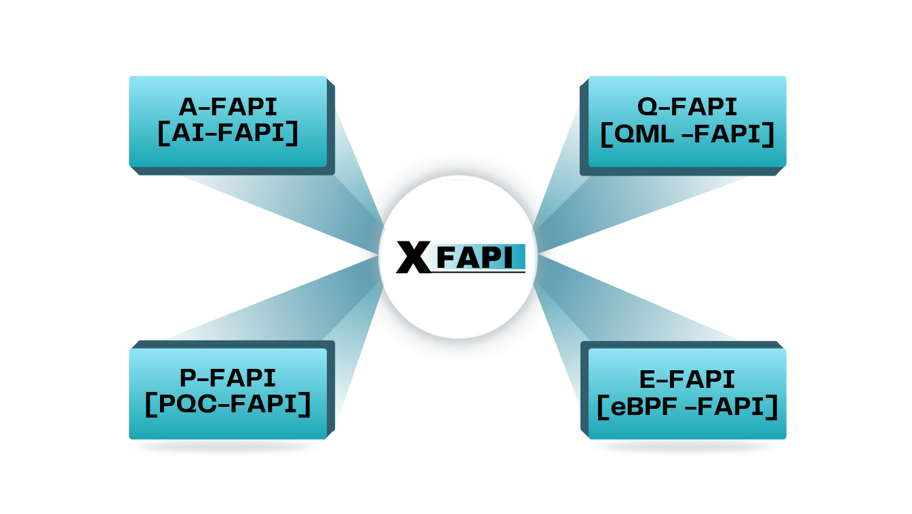

<table style="border-collapse: collapse; border: none; width: 100%;">
  <tr style="border-collapse: collapse; border: none;">
    <td style="border-collapse: collapse; border: none;">
      
    </td>
    <td style="border-collapse: collapse; border: none; width: 100%; text-align: center;">
      <b><h1>xFAPI: The Future of OpenRAN.</h1></b>
    </td>
  </tr>
</table>

<i>"Making the OpenRAN Truly Open."</i>

## Table of Contents
- [Introduction](#introduction)
- [Interoperability Issue in FAPI Interface](#interoperability-issue-in-fapi-interface)
- [xFAPI Architecture](#xfapi-architecture)
- [Need of xFAPI](#need-of-xfapi)
- [Current Status](#current-status)
  - [FlexRAN OSC DU-High Topology](#flexran-osc-du-high-topology)
  - [OAI L1 OSC DU-High Topology](#oai-l1-osc-du-high-topology)
- [Additional Features](#additional-features)
- [xFAPI Ecosystem](#xfapi-ecosystem)
- [References](#references)

## Introduction

xFAPI is an intermediate component that facilitates interoperability between L1s and L2s from different vendors.
xFAPI acts as a translator, providing interoperability between different IPC mechanisms, including shared memory (xSM) and sockets (nFAPI). 

> [NOTE]  
> xSM is a comprehensive shared memory library supporting various shared memory mechanisms, enabling L1 and L2 vendors to exchange messages on a common platform.

## Interoperability Issue in FAPI interface
Interoperability between Layer 1 (L1) and Layer 2 (L2) components in Open RAN remains a significant challenge despite the existence of the FAPI specification. 

While FAPI provides a standardized interface for communication, different vendors implement it with slight variations in message formats, timing requirements, parameter interpretations, and optional features. 

Complex Integration: L2-L3 vendors aiming to demonstrate interoperability with different L1s face the challenge of managing multiple intermediary components and shared memory libraries, one for each L1 vendor.

These inconsistencies lead to failures in message exchange, synchronization issues, and incompatibilities between L1 and L2 components from different vendors. As a result, seamless integration of multi-vendor solutions in Open RAN is hindered, limiting the flexibility and scalability that Open RAN promises.

### xFAPI Architecture

## Reference Architecture

## Need of xfapi
xFAPI is an interoperable component designed to enable seamless connectivity between Layer 1 (L1) and Layer 2 (L2) components from different vendors, which are not inherently interoperable.

It acts as a bridge by facilitating communication across various inter-process communication (IPC) mechanisms, such as sockets and shared memory, while also providing translation between different API standards.

By eliminating vendor lock-in associated with the FAPI interface, xFAPI ensures a vendor-agnostic Radio Access Network (RAN) stack, enhancing flexibility and interoperability within the ecosystem.

## Current Status

### L1-L2 Support

| L1      | L2  | Status      |
| ------- | --- | ----------- |
| FlexRAN | OSC | ✅ Done     |
| OAI     | OSC | 🟡 Ongoing  |
| Aerial  | OSC | 🟡 Ongoing  |
| FlexRAN | OAI | 📅 Planning |
| Aerial  | OAI | 📅 Planning |

#### FlexRAN OSC DU-High Topology

- xFAPI has successfully achieved end-to-end (E2E) connection between OSC DU-High and FlexRAN versions `v22.11` and `v23.07`.

  - **Topology:** 3GPP-Compliant 5G Core + modified OAI CU + modified OSC DU-High + xFAPI + FlexRAN v22.11/v23.07 + LiteON

#### OAI L1 OSC DU-High Topology

- xFAPI is currently being modified to support the nFAPI interface at the L1 side, which will enable a successful connection between OSC DU-High and OAI L1.

  - **Topology:** 3GPP-Compliant 5G Core + modified OAI CU + modified OSC DU-High + xFAPI + OAI L1 + LiteON + COTS UE

## Additional Features

- **Dashboard Support:** xFAPI includes an advanced dashboard that provides detailed statistics, PDU analysis, and debugging tools. It offers seamless integration with various OpenRAN vendors on a unified platform.

- **Simulation Mode:** Vendors can test their components for compatibility with any of the supported L1 or L2 implementations without requiring physical access to them. xFAPI's simulation mode enables comprehensive interoperability testing in a virtualized environment.

## xFAPI EcoSystem

#### 🔵 AI-xFAPI
xFAPI integrates an AI/ML framework and an InfluxDB-based DataLake for intelligent automation. It features dedicated O1 and E2 interfaces, facilitating seamless connection with SMO and near-RT RIC, allowing better data/KPI extraction and model training.
#### 🔵 PQC-xFAPI
Establishes a highly secure communication channel between L1 and L2 components across diverse IPC mechanisms using advanced lattice-based post-quantum cryptography (PQC).

Fortifies shared memory-based communication by mitigating vulnerabilities against buffer overflow attacks, RDMA-based exploits, and other threats.
#### 🔵 eBPF-xFAPI
Implements kernel-level packet filtering and real-time traffic monitoring, enabling highly optimized and low-latency message processing over the FAPI interface.

Enhances system stability and performance by leveraging eBPF’s in-kernel execution capabilities, allowing efficient interception, classification, and forwarding of critical control and data messages.

#### 🔵 QML-xFAPI
Utlising Quantum Machine Learning for reducing error rates in L1-L2 communication, ensuring higher precision and reliability.Future-proofs xFAPI by integrating quantum computing techniques, paving the way for next-generation advancements in OpenRAN stack.

## References

| **Topic**             | **Type**     | **Links**                                                                                                                                                                                                                                                                                                                                                               |
| --------------------- | ------------ | ----------------------------------------------------------------------------------------------------------------------------------------------------------------------------------------------------------------------------------------------------------------------------------------------------------------------------------------------------------------------- |
| Introduction to xFAPI | Video        | [Watch](https://youtu.be/1oO_DIiZfug?si=m9HwykFD4aMxpYi7)                                                                                                                                                                                                                                                                                                               |
| xFAPI Proposal        | Presentation | [View](https://wiki.o-ran-sc.org/download/attachments/78217260/xFAPI%20Proposal.pdf?api=v2)                                                                                                                                                                                                                                                                             |
|                       | Recording    | [Watch](https://zoom.us/rec/play/G54aZjpA34mBBkagXaHKS2-czoy8oEQ8m7bPI7vaKgSvH1UGqwSx0bx3uF7Bb37RRgQpOp1f-4v4Wo0i.KJt64HspDhWl75ov?canPlayFromShare=true&from=share_recording_detail&continueMode=true&componentName=rec-play&originRequestUrl=https%3A%2F%2Fzoom.us%2Frec%2Fshare%2F-ZFH16_eVRto4atlwUE6l77dKtoJj53_bfZvZ3wgWWI9nDJc3dvZZiK-A5v-5Nrh.PyEgerJdoNW9qQbR) |
| xFAPI Blueprint       | Presentation | [View](https://wiki.o-ran-sc.org/download/attachments/78217260/xFAPI%20Blueprint.pdf?api=v2)                                                                                                                                                                                                                                                                            |
|                       | Recording    | [Watch](https://zoom.us/rec/play/deV06o9uQO1JlMRg93UIJHh6CYleU8OeYPl11zRVZkdiYKycdQWwnArWUvwIJdOmH1jVVh151063WRKW.UR4vegH8q1lK3187?canPlayFromShare=true&from=share_recording_detail&continueMode=true&componentName=rec-play&originRequestUrl=https%3A%2F%2Fzoom.us%2Frec%2Fshare%2FwmQNLvP9c1nOTzGHQsoaA7zP-lgwFO0XUW2OWIcTC2KtBNAIOIKlwib6pvvpENiD.Rkmvy2QyiMAk-bT1) |
|xFAPI Deployment Guide- O-RAN-SC K-Release| Doc    | [View](https://lf-o-ran-sc.atlassian.net/wiki/spaces/IAT/pages/176226489/xFAPI+Deployment+Guideline) |
|xFAPI Deployment in O-RAN-SC Lab,Taiwan| Video    | [Watch](https://www.youtube.com/watch?v=sXFv2xor5pg) |
