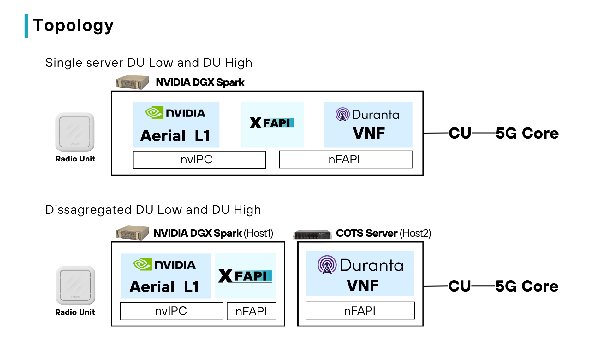
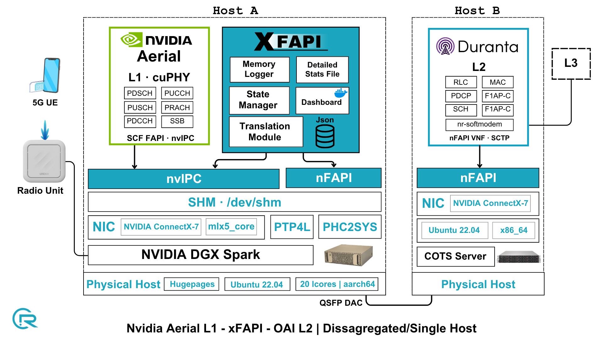

# xFAPI - Build & Run (AERIAL_OAI)

Bridges Aerial L1 (SCF FAPI over nvIPC) with OAI L2 (classic nFAPI over sockets).

```
Aerial L1  <--nvIPC SHM (SCF FAPI)-->  xFAPI  <--SCTP P5 / UDP P7 (nFAPI)-->  OAI L2
```

xFAPI is the nvIPC SECONDARY toward Aerial and the nFAPI PNF toward OAI. The
OAI MAC runs as the nFAPI VNF (the SCTP server); xFAPI connects out to it.
This mode uses no DPDK, no xSM, and no hugepages.

OAI L2 can run on the same host as xFAPI or on a separate (disaggregated)
server. Only the IPs/ports in the config change (see step 6).

## Topology



## Architecture



## 1. Prerequisites

```bash
sudo apt update
sudo apt install -y build-essential cmake pkg-config \
                    libyaml-dev zlib1g-dev libsctp-dev
```

## 2. Sync the OAI nFAPI sources

Mirror the OAI nFAPI sources into `src/ipc/nfapi`:

```bash
./sync_nfapi.sh /path/to/openairinterface
# or: OAI_DIR=/path/to/openairinterface ./sync_nfapi.sh
```

`-n` for a dry run, `-v` for verbose, `-h`/`--help` for usage.

## 3. Get the nvIPC sources into the tree

The nvIPC source is packed from a running Aerial container.

Bring up the Aerial container (drops you into its terminal, tty mode):

```bash
/home/user/aerial-cuda-accelerated-ran/cuPHY-CP/container/run_aerial.sh
```

Inside the container, generate the nvipc tarball:

```bash
cd cuPHY-CP/gt_common_libs
./pack_nvipc.sh
```

It prints the output path, e.g.:

```
/opt/nvidia/cuBB/cuPHY-CP/gt_common_libs/nvipc_src.2026.07.13.tar.gz
```

Back on the host, copy it into xFAPI:

```bash
docker cp "aerial-l1:/opt/nvidia/cuBB/cuPHY-CP/gt_common_libs/nvipc_src.2026.07.13.tar.gz" /home/user/xFAPI
```

Unpack it into `src/ipc/nvipc` (use the actual filename from the step above):

```bash
rm -rf src/ipc/nvipc
mkdir -p src/ipc/nvipc
tar -xzf nvipc_src.2026.07.13.tar.gz \
    -C src/ipc/nvipc \
    --strip-components=1
```

Build the nvIPC library:

```bash
cd src/ipc/nvipc
cmake .
make -j$(nproc)
```

On success `nvIPC/libnvipc.so` is produced:

```bash
ls nvIPC/libnvipc.so
```

## 4. Build

From the repo root:

```bash
./build_xfapi.sh --mode=aerial_oai
```

Produces `bin/xfapi_main`. `--clean` to wipe `build/` and `bin/`; `-v` for
verbose; `--help` for all options.

## 5. Configure

```
conf/aerial_oai_config.yaml
```

Key fields:

- `nvipc.prefix` - must match Aerial cuphycontroller's `shm_config.prefix`.
- `nfapi_socket` - the SCTP P5 / UDP P7 endpoints toward OAI:
  - `remote_ip` = OAI L2 (VNF) address, `local_ip` = this xFAPI (PNF) address.
  - `p5_remote_port` / `p5_local_port` (SCTP), `p7_remote_port` / `p7_local_port` (UDP).

Same host: set `remote_ip` and `local_ip` to `127.0.0.1`.

Disaggregated: set `remote_ip` to the OAI-L2 host and `local_ip` to the xFAPI
host, reachable over the network. The port mapping to OAI's `MACRLCs`
(`remote_s_address` / `local_s_address`, `*_portc` for P5, `*_portd` for P7)
is documented inline in the YAML.

## 6. Run

Start xFAPI first, then bring up Aerial (nvIPC PRIMARY) so xFAPI's secondary
attaches, then start the OAI MAC (VNF). xFAPI (PNF) connects out to OAI over
SCTP.

```bash
./run_xfapi.sh
```

`run_xfapi.sh` uses the config in `MAIN_CONFIG_FILE` at the top of the script.
Set it to `conf/aerial_oai_config.yaml`, or run the binary directly:

```bash
sudo ./bin/xfapi_main --cfgfile conf/aerial_oai_config.yaml
```

## 7. Stopping

Press `Ctrl+C`. The handler flushes `generated_logs/message_stats.json` and
(if enabled in the config) `generated_logs/xfapi_logs.txt`.
