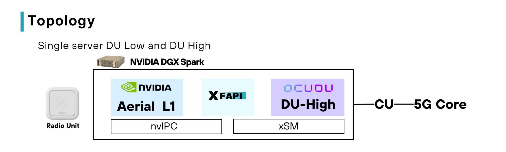
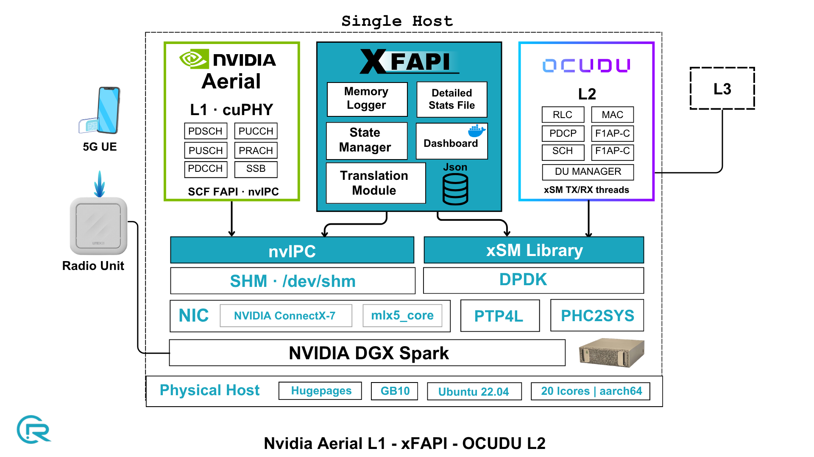

# xFAPI - Build & Run (AERIAL_OCUDU)

Bridges Aerial L1 (SCF FAPI over nvIPC shared memory) with OCUDU L2 (xSM shared memory).

```
Aerial L1  <--nvIPC SHM (SCF FAPI)-->  xFAPI  <--xSM pair 1-->  OCUDU-L2
```

xFAPI is the nvIPC SECONDARY toward Aerial and the DPDK PRIMARY / xSM SLAVE
toward OCUDU-L2.

## Topology



## Architecture



## 1. Prerequisites

```bash
sudo apt update
sudo apt install -y build-essential cmake pkg-config \
                    libyaml-dev zlib1g-dev libhugetlbfs-dev
```

DPDK is required (the OCUDU-L2 side uses it). Set `DPDK_PATH` in `setup_env.sh`
(repo root) and source it before building:

```bash
source setup_env.sh
```

This exports `DPDK_PATH` and `PKG_CONFIG_PATH`.

## 2. Sync the OAI nFAPI sources

Mirror the OAI nFAPI sources into `src/ipc/nfapi`:

```bash
./sync_nfapi.sh /path/to/openairinterface
# or: OAI_DIR=/path/to/openairinterface ./sync_nfapi.sh
```

`-n` for a dry run, `-v` for verbose, `-h`/`--help` for usage.

## 3. Get the nvIPC sources into the tree

The nvIPC source is packed from a running Aerial container.

Bring up the Aerial container (drops you into its terminal, tty mode):

```bash
/home/user/aerial-cuda-accelerated-ran/cuPHY-CP/container/run_aerial.sh
```

Inside the container, generate the nvipc tarball:

```bash
cd cuPHY-CP/gt_common_libs
./pack_nvipc.sh
```

It prints the output path, e.g.:

```
/opt/nvidia/cuBB/cuPHY-CP/gt_common_libs/nvipc_src.2026.07.13.tar.gz
```

Back on the host, copy it into xFAPI:

```bash
docker cp "aerial-l1:/opt/nvidia/cuBB/cuPHY-CP/gt_common_libs/nvipc_src.2026.07.13.tar.gz" /home/user/xFAPI
```

Unpack it into `src/ipc/nvipc` (use the actual filename from the step above):

```bash
rm -rf src/ipc/nvipc
mkdir -p src/ipc/nvipc
tar -xzf nvipc_src.2026.07.13.tar.gz \
    -C src/ipc/nvipc \
    --strip-components=1
```

Build the nvIPC library:

```bash
cd src/ipc/nvipc
cmake .
make -j$(nproc)
```

On success `nvIPC/libnvipc.so` is produced:

```bash
ls nvIPC/libnvipc.so
```

## 4. Hugepages (one-time, per boot)

```bash
echo 1024 | sudo tee /sys/kernel/mm/hugepages/hugepages-2048kB/nr_hugepages
sudo mkdir -p /mnt/huge
sudo mount -t hugetlbfs nodev /mnt/huge
```

## 5. Build

From the repo root:

```bash
./build_xfapi.sh --mode=aerial_ocudu
```

Produces `bin/xfapi_main`. `--clean` to wipe `build/` and `bin/`; `-v` for
verbose; `--help` for all options.

## 6. Configure

```
conf/aerial_ocudu_config.yaml
```

Key fields: `nvipc.prefix` (must match Aerial cuphycontroller's
`shm_config.prefix`), `dpdk_config.dpdk_memory_zone`, and the xSM memzone
settings toward OCUDU-L2.

## 7. Run

Start xFAPI first (it creates the L2 memzone), then bring up Aerial (nvIPC
PRIMARY) while xFAPI's secondary retries the attach, then start OCUDU-L2.

```bash
./run_xfapi.sh
```

`run_xfapi.sh` uses the config in `MAIN_CONFIG_FILE` at the top of the script.
Set it to `conf/aerial_ocudu_config.yaml`, or run the binary directly:

```bash
sudo ./bin/xfapi_main --cfgfile conf/aerial_ocudu_config.yaml
```

## 8. Stopping

Press `Ctrl+C`. The handler flushes `generated_logs/message_stats.json` and
(if enabled in the config) `generated_logs/xfapi_logs.txt`.
