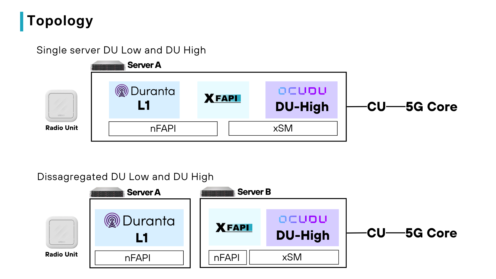
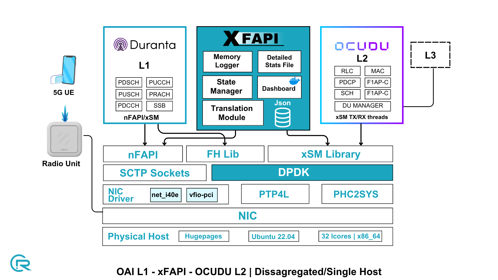

# xFAPI - Build & Run (OAI_OCUDU)

Bridges OAI L1 (nFAPI over UDP sockets) with OCUDU L2 (xSM shared memory).

```
OAI L1  <--UDP nFAPI (P5/P7)-->  xFAPI  <--xSM pair 1-->  OCUDU-L2
```

xFAPI is the nFAPI VNF toward OAI and the DPDK PRIMARY / xSM SLAVE toward OCUDU-L2.

## Topology



## Architecture



## 1. Prerequisites

```bash
sudo apt update
sudo apt install -y build-essential cmake pkg-config \
                    libyaml-dev zlib1g-dev libhugetlbfs-dev
```

DPDK is still required (the OCUDU-L2 side uses it). Set `DPDK_PATH` in
`setup_env.sh` (repo root) and source it before building:

```bash
source setup_env.sh
```

This exports `DPDK_PATH` and `PKG_CONFIG_PATH`.

## 2. Sync the OAI nFAPI sources

The OAI modes need the OAI nFAPI sources mirrored into `src/ipc/nfapi`.
Point `sync_nfapi.sh` at an OAI checkout:

```bash
./sync_nfapi.sh /path/to/openairinterface
# or: OAI_DIR=/path/to/openairinterface ./sync_nfapi.sh
```

`-n` for a dry run, `-v` for verbose, `-h`/`--help` for usage.

## 3. Build

```bash
./build_xfapi.sh --mode=oai_ocudu
```

Produces `bin/xfapi_main`. `--clean` to wipe `build/` and `bin/`; `-v` for
verbose; `--help` for all options.

## 4. Hugepages (one-time, per boot)

```bash
echo 1024 | sudo tee /sys/kernel/mm/hugepages/hugepages-2048kB/nr_hugepages
sudo mkdir -p /mnt/huge
sudo mount -t hugetlbfs nodev /mnt/huge
```

## 5. Configure

```
conf/oai_ocudu_config.yaml
```

Key fields: `nfapi_socket` (remote_ip/local_ip and the P5/P7 ports toward OAI),
`dpdk_config.dpdk_memory_zone`, and the xSM memzone settings toward OCUDU-L2.
The port mapping to OAI's `nfapi_socket` config is documented inline in the
YAML.

## 6. Run

```bash
./run_xfapi.sh
```

`run_xfapi.sh` uses the config in `MAIN_CONFIG_FILE` at the top of the script.
Set it to `conf/oai_ocudu_config.yaml`, or run the binary directly:

```bash
sudo ./bin/xfapi_main --cfgfile conf/oai_ocudu_config.yaml
```

Start xFAPI first (it creates the memzone), then OCUDU-L2, then OAI L1.

## 7. Stopping

Press `Ctrl+C`. The handler flushes `generated_logs/message_stats.json` and
(if enabled in the config) `generated_logs/xfapi_logs.txt`.
